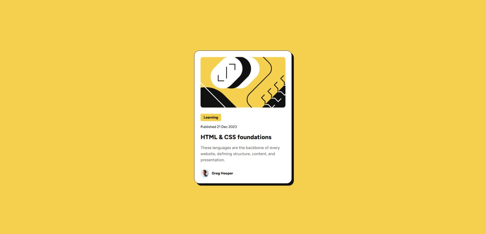

# Frontend Mentor - Blog preview card solution

This is my solution to the [Blog preview card challenge on Frontend Mentor](https://www.frontendmentor.io/challenges/blog-preview-card-ckPaj01IcS). 

## Table of contents

- [Overview](#overview)
  - [The challenge](#the-challenge)
  - [Screenshot](#screenshot)
  - [Links](#links)
- [My process](#my-process)
  - [Built with](#built-with)
  - [What I learned](#what-i-learned)
- [Author](#author)

## Overview

### The challenge

This challenge was an easy one, focused on CSS and HTML only.

### Screenshot

### Links

- Live Site URL: [Add live site URL here](https://your-live-site-url.com)

## My process

### Built with

- Semantic HTML5 markup
- CSS custom properties
- Flexbox
- Responsive Design

### What I learned

Even though is was a easy solution, I reviewed things that I already knew. Like Flex-box and CSS Variables. I folowed the good practice of keeping the code organized and uses of variables.

## Author

- Frontend Mentor - [@yourusername](https://www.frontendmentor.io/profile/Vinicius-PR)
- Linkedin - [@yourusername](https://www.linkedin.com/in/vinicius-paula-resende/)
